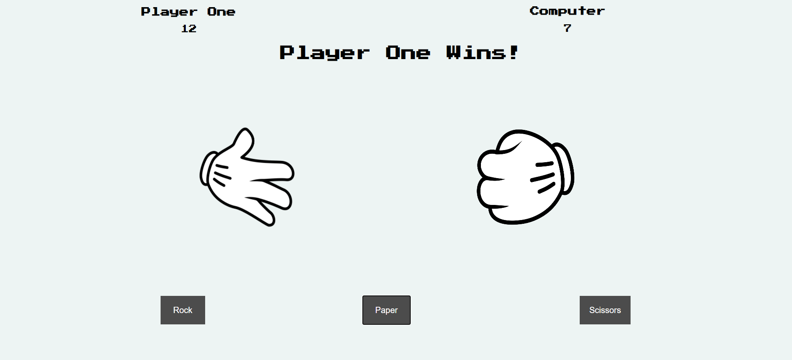

# Rock-Paper-Scissors

The classic Rock Paper Scissors game, no parter needed. Created with HTML, CSS and JavaScript.

Play it [here!](https://kaelix.github.io/rock-paper-scissors/)

# How to play:
- User is "player one"
- Make a selection of either "Rock" "Paper" or "Scissors" with the designated buttons towards the bottom
- Computer will randomly generate a selection
- Score will be added to the winners bracket at the top of the page

# Example Image

# Summary

The first game I made using JavaScript. Making this project taught me so much about software development and how to problem solve when running into issues that I hadnt come across. While still challenging, 
the outcome is very rewarding. I look forward to making more projects and using the knowledge I gained from this game to further my skills and keep learning to make more complex applications.
As the first ever game I've made on my own I'm extremly happy with the outcome and am encouraged to continue my journey.  

# Author

Cesar Preza - Software Developer [linkdin](https://www.linkedin.com/in/cesar-preza-72675278/)
